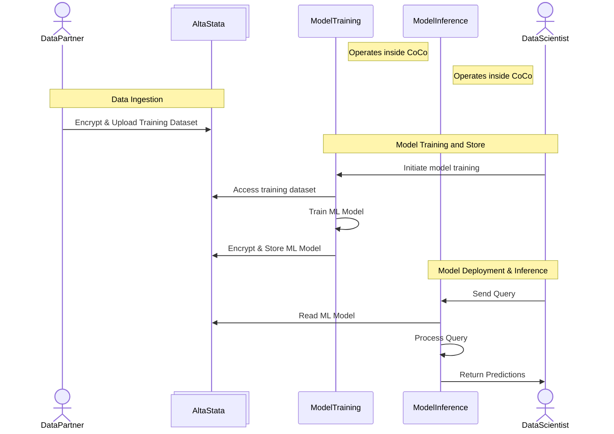

# ML Training & Deployment Flow - Mermaid Sequence Diagram

## Participants:
1. **Data Partner** - Uploads training datasets
2. **Data Scientist** - Sends queries to deployed model
3. **AltaStata** - Encrypted storage for datasets and models
4. **Model Training** - PyTorch/TensorFlow for model training
5. **Model Inference** - Handles model deployment and inference processing

## Key Features:
- ✅ Three distinct phases: Data Ingestion → Model Training → Model Deployment & Inference
- ✅ Encrypted storage at every stage (datasets and models)
- ✅ Direct access: ModelTraining streams from AltaStata during training
- ✅ Model lifecycle: train → store → deploy → infer
- ✅ DataScientist queries deployed model through ModelInference

