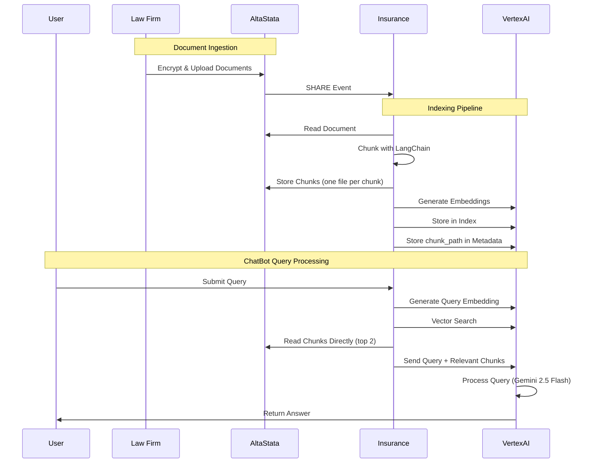

# RAG System Architecture Diagram

## Complete System Flow

```mermaid
graph TB
    subgraph "DOCUMENT INGESTION"
        A[📄 Alice Uploads Documents] --> B[🔐 AltaStata Encrypted Storage]
        B --> C[🔔 SHARE Event Triggered]
        C --> D[👂 Bob Event Listener]
    end
    
    subgraph "INDEXING PIPELINE"
        D --> E[📖 Read Document from AltaStata]
        E --> F[✂️ Chunk Document with LangChain]
        F --> F1[💾 Store Chunks in AltaStata]
        F1 --> G[🧠 Generate Embeddings]
        G --> H[💾 Store in Vertex AI Index]
        H --> I[🏷️ Store chunk_path in Metadata]
    end
    
    subgraph "QUERY PROCESSING"
        J[❓ User Query] --> K[🧠 Query Embedding Generation]
        K --> L[🔍 Vertex AI Vector Search (COSINE_DISTANCE)]
        L --> M[📊 Top 3 Most Similar Documents]
        M --> N[🎯 Retrieve Relevant Chunks]
        N --> O[📋 Extract Metadata from Datapoint ID]
        O --> P[📖 Read Chunk Directly from AltaStata]
        P --> R[📄 Use Chunk Content]
        R --> S[📝 Build Context for LLM]
        S --> T[🤖 Generate Response via Vertex AI (Gemini 2.5 Flash)]
    end
    
    subgraph "LANGCHAIN INTEGRATION"
        U[📚 Document Loader] --> V[✂️ Text Splitter]
        V --> W[🧠 Embeddings Generation]
        W --> X[💾 Vector Store Operations]
    end
    
    subgraph "VERTEX AI VECTOR SEARCH"
        Y[📊 Vector Index] --> Z[🔍 Similarity Search]
        Z --> AA[🏷️ Metadata in Datapoint ID]
        AA --> BB[🚀 Endpoint Deployment]
    end
    
    subgraph "ALTASTATA INTEGRATION"
        CC[📁 fsspec Filesystem Interface] --> DD[🔐 Encrypted File Operations]
        DD --> EE[⚡ Event-Driven Architecture]
        EE --> FF[🔔 Real-time Notifications]
    end
    
    %% Data Flow Connections
    B --> E
    E --> P
    H --> L
    N --> O
    O --> P
    P --> R
    R --> S
    S --> T
    
    %% Integration Connections
    F --> V
    F1 --> CC
    G --> W
    H --> X
    L --> Z
    E --> CC
    P --> CC
    
    %% Styling
    classDef ingestion fill:#e1f5fe,stroke:#01579b,stroke-width:2px
    classDef indexing fill:#e8f5e8,stroke:#1b5e20,stroke-width:2px
    classDef query fill:#f3e5f5,stroke:#4a148c,stroke-width:2px
    classDef langchain fill:#fff3e0,stroke:#e65100,stroke-width:2px
    classDef vertex fill:#fce4ec,stroke:#880e4f,stroke-width:2px
    classDef altastata fill:#f1f8e9,stroke:#33691e,stroke-width:2px
    
    class A,B,C,D ingestion
    class E,F,F1,G,H,I indexing
    class J,K,L,M,N,O,P,R,S,T query
    class U,V,W,X langchain
    class Y,Z,AA,BB vertex
    class CC,DD,EE,FF altastata
```

## Detailed Component Flow



## Key Architecture Features

### 🔐 **Secure Document Storage**
- Documents stored encrypted in AltaStata
- No local metadata files needed
- Real-time event-driven processing

### 🚀 **Efficient Chunk Retrieval**
- Chunks stored in AltaStata during indexing (one file per chunk)
- Chunks retrieved directly from AltaStata (no re-chunking needed)
- Metadata (chunk_path) stored in Vertex AI restricts for fast lookup

### 🎯 **Intelligent Search**
- **COSINE_DISTANCE** similarity metric for better semantic ranking
- Top 2 most similar documents selected for context
- Vector similarity search in Vertex AI with improved accuracy
- Reliable semantic ranking without threshold complexity

### ⚡ **Performance Optimized**
- No large local storage requirements
- Scalable cloud-native architecture
- Event-driven real-time processing

### 🔄 **LangChain Integration**
- Native support for document loaders
- Standard text splitting and embeddings
- Compatible with existing LangChain workflows

## Technical Improvements

### 🎯 **COSINE_DISTANCE vs DOT_PRODUCT_DISTANCE**

**Problem Solved:**
- **DOT_PRODUCT_DISTANCE** was biased by document length, ranking longer documents higher even when less relevant
- **COSINE_DISTANCE** normalizes by vector magnitude, focusing on semantic similarity regardless of document size

**Example Impact:**
- **Before**: `ai_usage_policy.txt` (0.419) ranked higher than `security_guidelines.txt` (0.642) for password queries
- **After**: `security_guidelines.txt` correctly ranked first for security-related queries

**Configuration:**
```python
distance_measure_type="COSINE_DISTANCE"  # Better semantic similarity
```

### 🔧 **Simplified Result Selection**
- **Approach**: Always use top 2 most similar documents
- **Rationale**: COSINE_DISTANCE already provides correct semantic ranking
- **Result**: Simple, consistent behavior with best matches
