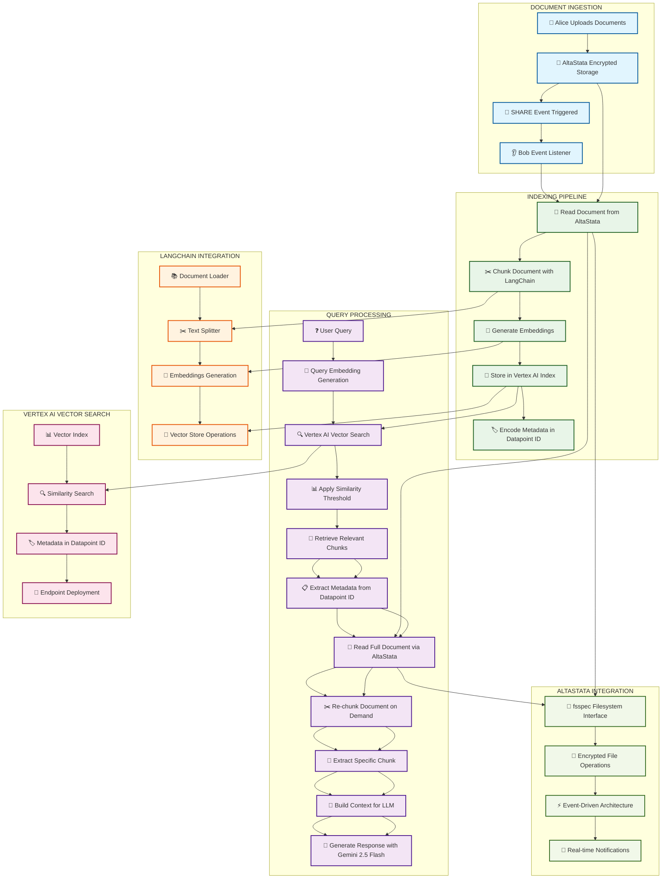
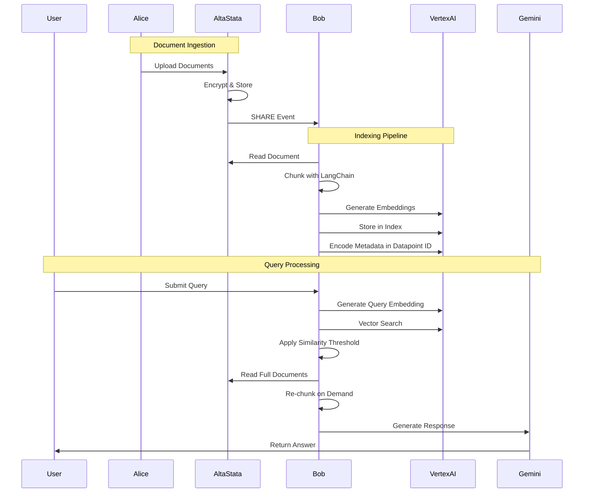

# RAG System Architecture Diagram

## Complete System Flow

## Detailed Component Flow

## Key Architecture Features

### 🔐 **Secure Document Storage**
- Documents stored encrypted in AltaStata
- No local metadata files needed
- Real-time event-driven processing

### 🚀 **On-Demand Retrieval**
- Full documents retrieved via fsspec when needed
- Re-chunking on demand for exact content extraction
- Metadata encoded in Vertex AI datapoint IDs

### 🎯 **Intelligent Search**
- Similarity threshold filtering (0.6)
- Vector similarity search in Vertex AI
- Context-aware document retrieval

### ⚡ **Performance Optimized**
- No large local storage requirements
- Scalable cloud-native architecture
- Event-driven real-time processing

### 🔄 **LangChain Integration**
- Native support for document loaders
- Standard text splitting and embeddings
- Compatible with existing LangChain workflows
